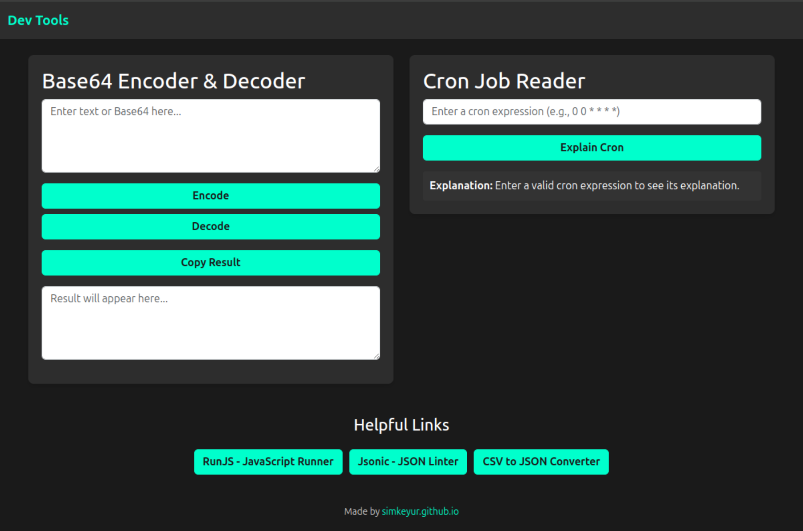

# Dev Tools

A modern web app for developers, featuring a **Base64 Encoder/Decoder**, **Cron Job Reader**, and helpful utilities. Built with simplicity and functionality in mind.

## Features

- **Base64 Encoder & Decoder**: Encode and decode text with ease.
- **Cron Job Reader**: Understand cron expressions with a human-readable explanation.
- **Helpful Links**: Quick access to tools like RunJS, Jsonic, and CSV to JSON Converter.
- **PWA Support**: Installable and works offline.

## Live Demo

Check out the live demo hosted on GitHub Pages:  
[Dev Tools Live Demo](https://simkeyur.github.io/devtoolbox)

## How to Use

1. **Base64 Encoder/Decoder**:
   - Enter text in the input box.
   - Click "Encode" or "Decode" to convert.
   - Copy the result with the "Copy Result" button.

2. **Cron Job Reader**:
   - Enter a cron expression (e.g., `0 0 * * * *`).
   - Click "Explain Cron" to see a detailed explanation.

3. **Helpful Links**:
   - Use the buttons at the bottom to access additional developer tools.

